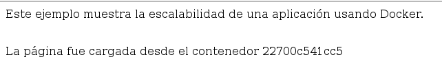

# Docker Scalability Demo

This demo demostrates docker services scalability with a simple scenario. 

## Running

```bash
$ docker stack deploy -c docker-compose.yml scalability-demo
```

## Testing

Open this url http://127.0.0.1:5000/hostname   
You will see something like this:   
  
   

Scale up or down the service and watch how every request is answered by a different container!!

```bash
$ docker service scale scalability-demo_docker-scalability-demo=3
```
### Have fun with Docker!

